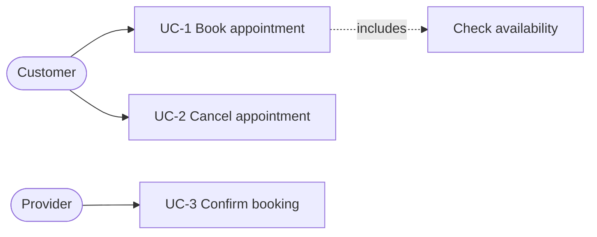
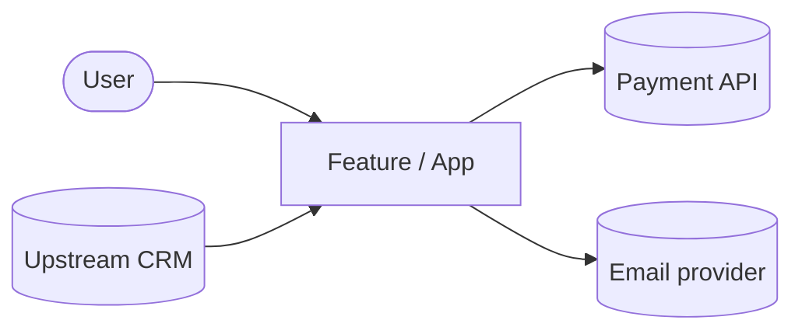
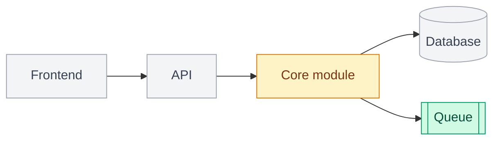
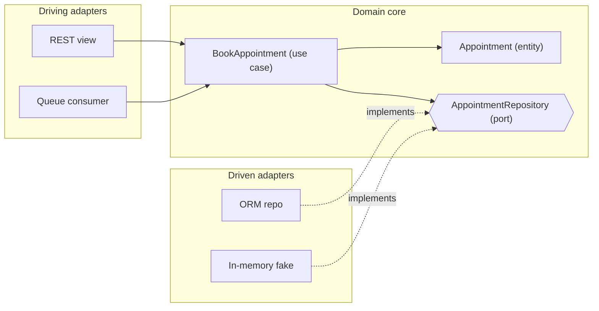
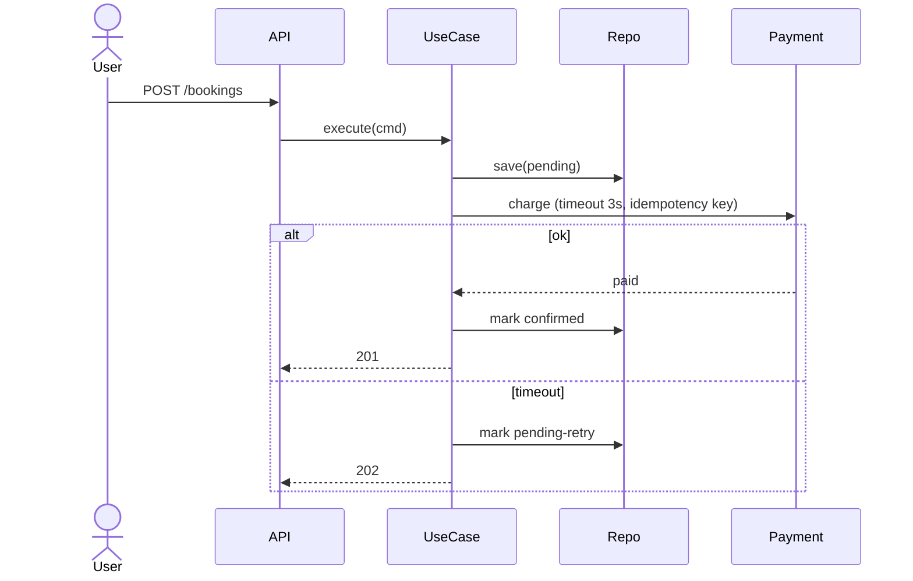
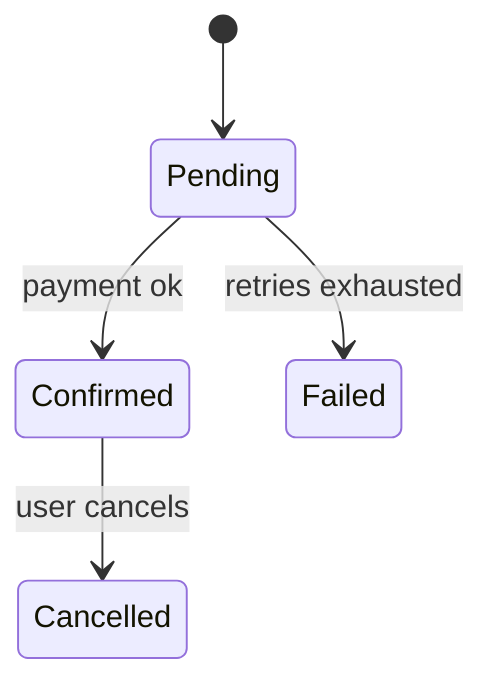
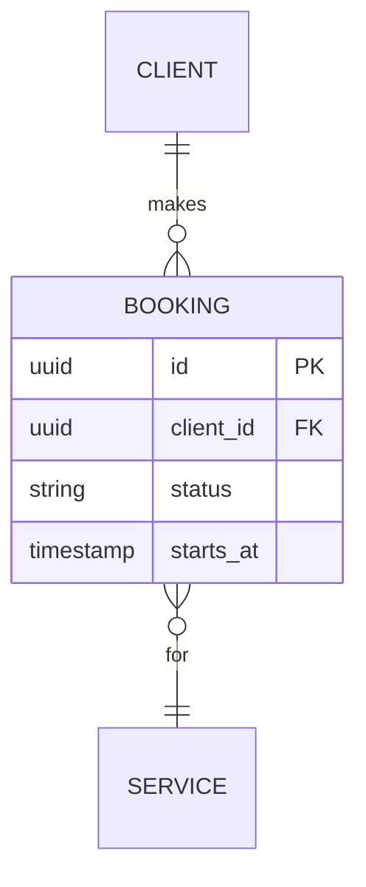
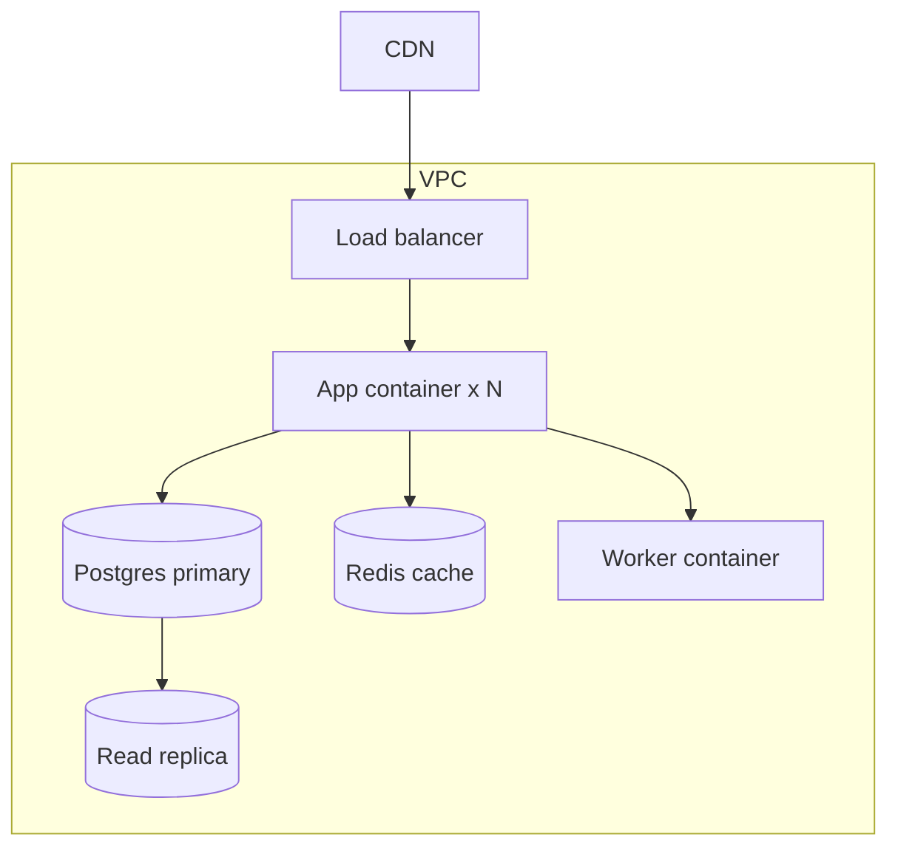
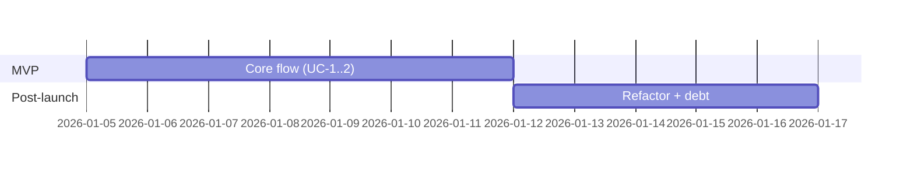

# Diagram snippets (Mermaid)

Use `<pre class="mermaid">` in HTML. Keep labels short; max ~12 nodes per diagram; one caption line under each. Color code: new = green, changed = amber, existing = gray via `classDef`.

## Use cases (actors -> UC)

## Context

## Component map with change markers

## Building blocks - ports and adapters

## Runtime sequence (with failure path)

## State

## Data (ER)

## Deployment

## Phase plan

