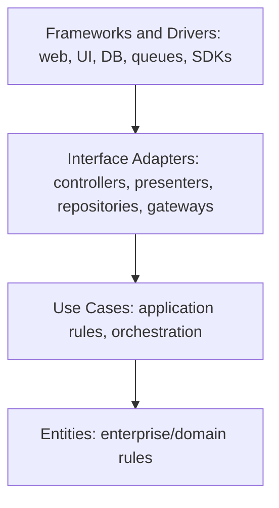

# Architectural patterns - decision guide

## Contents
1. Clean Architecture
2. Hexagonal (Ports and Adapters)
3. Decomposition and scaling
4. Choosing: quick rules

## 1. Clean Architecture (Dependency Rule)

Source code dependencies point **inward only**.

| Layer | Contains | May import | Must NOT import |
|---|---|---|---|
| Entities | Domain objects, invariants, value objects | nothing external | everything else |
| Use cases | One class/function per user intention, ports | Entities | adapters, frameworks, ORM, HTTP |
| Interface adapters | Controllers/views, serializers, repo implementations, DTO mappers | Use cases, Entities | - |
| Frameworks/drivers | Framework config, DB, UI toolkit, SDKs | anything inward | - |

Cross a boundary with simple data structures (DTOs), never ORM models or request objects. Inversion: the inner layer defines the interface; the outer layer implements it.

## 2. Hexagonal (Ports and Adapters)

The domain core is surrounded by **ports** (interfaces owned by the core); **adapters** plug technology into ports.

| Term | Meaning | Example |
|---|---|---|
| Driving (primary) port | What the outside calls | `BookAppointment.execute(cmd)` |
| Driving adapter | Triggers the port | REST view, CLI, queue consumer, page/server action |
| Driven (secondary) port | What the core needs | `AppointmentRepository`, `PaymentGateway`, `Clock`, `Notifier` |
| Driven adapter | Implements the port | ORM repo, Stripe client, SMTP, in-memory fake |

Rules:
- Name every port and its adapters in the building-block view.
- Each driven port has a **real adapter and an in-memory/fake adapter** (fast tests, swappable tech).
- No business logic in adapters.

Clean and Hexagonal are compatible: Clean's layers decide *where code lives*; Hexagonal's ports decide *how it talks outward*.

Example mapping (Django + Next.js): `domain/` + `use_cases/` = core; `ports.py` = interfaces; `adapters/` = ORM repos and API clients; views/serializers = driving adapters. In Next.js, route handlers, server actions and components call use-case functions; data fetchers are driven adapters.

## 3. Decomposition and scaling

### Deployment shape

| Option | Pick when | Watch out for |
|---|---|---|
| **Monolith** | Small team, one domain, speed matters | Boundaries erode without discipline |
| **Modular monolith** (default) | Clear domains, one deploy unit, boundaries enforceable | Needs enforced module APIs; shared-DB temptation |
| **Microservices** | Independent scaling/deploy/ownership is a proven need, multiple teams | Distributed failure, consistency, ops cost. Never by default |
| **Serverless / FaaS** | Spiky or event-driven workloads, glue tasks | Cold starts, lock-in, timeouts, local dev |

### Interaction and data patterns

| Pattern | Pick when | Cost |
|---|---|---|
| Sync request/response | Caller needs the result now | Temporal coupling |
| **Event-driven** (pub/sub, queues) | Decoupling, fan-out, async work | Eventual consistency, ordering, idempotency, observability |
| **CQRS** | Read and write models differ strongly, heavy reads | Two models to keep consistent; not for simple CRUD |
| Event sourcing | Audit trail or temporal queries are core | Schema evolution, replay |
| Outbox + idempotent consumers | Reliable event publish alongside DB writes | Extra table and relay |
| Saga | Multi-service transaction | Compensation logic |
| Cache-aside / CDN | Read-heavy, staleness tolerated | Invalidation |

## 4. Choosing - quick rules

1. Start from the quality attributes in Section 1. If none forces distribution, stay in-process.
2. Prefer modular monolith + ports; extract a service later behind an existing port.
3. Add events/CQRS/serverless only for a named need (throughput, decoupling, spiky load) and record an ADR with rejected alternatives.
4. List what you deliberately did not adopt; every "no" is as useful as a "yes".
